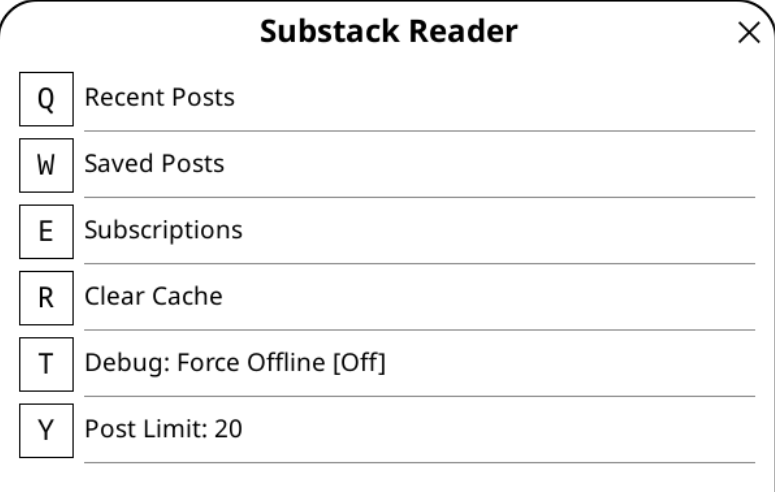
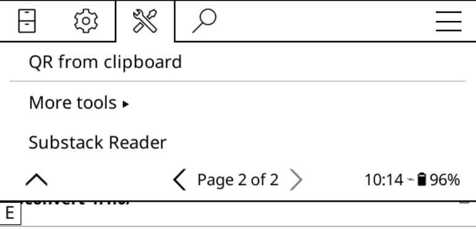

# Substack Reader for KOReader

A plugin for KOReader that allows fetching and reading Substack posts.

## Data privacy

**This plugin uses the cookie that is generated from a logged in substack account. You place the cookie in your koreader device. At no point do I have any knowledge of your cookie. The cookie is embedded in any HTTP requests to the substack official servers, just like when you the substack official app or website. From the point of view of substack, they do not know that you are using a KOReader plugin.**

## Substack plugin main menu

## Location of Substack Plugin when installed

## Install

Place the contents of this repo in the plugins folder of koreader, within a folder called `substack.koplugin`

## Features

### Content Fetching & Display
- **Inbox & Saved Posts**: Retrieve lists of recent and bookmarked posts.
- **Subscriptions**: View a list of all subscribed publications.
- **Post Rendering**: Converts Substack content to a clean HTML format suitable for KOReader's internal viewer.
- **Metadata**: Displays publication name, post title, subtitle, and date (formatted as "Dayth Month Year").
- **Images**: Automatically downloads images and allows clicking them to open in KOReader's full-screen viewer.
- **Image Toggle**: Quickly toggle images on/off within the post viewer.
- **Text Adjustment**: Adjustable font size and line spacing for comfortable reading.

### Newsletter Management
- **Favourites**: Mark specific newsletters as favorites to keep them at the top of the subscription list.
- **Manage Mode**: A dedicated mode in the Subscriptions menu to toggle favorite status via clicks.

### Offline & Cache
- **Caching**: Posts and images are stored locally after the first fetch.
- **Force Offline Mode**: A setting to disable network requests and use only cached data.
- **Post Limit**: Adjustable limit (1-100) for how many posts are fetched in lists.
- **Cache Management**: Option to clear all downloaded images, posts, and API response caches.
- **Network Robustness**: Automatically retries failed requests (due to flaky connections) with exponential backoff.

### System Integration
- **Gesture Support**: Support for registering "Substack Reader" as a gesture or QuickMenu action (KOReader Dispatcher).

## Setup

The plugin requires a `substack.sid` session cookie to authenticate requests.

### 1. Obtain Cookie
1. Log in to [substack.com](https://substack.com) in a web browser.
2. Open Developer Tools (F12).
3. Under the **Application** (Chrome/Edge) or **Storage** (Firefox) tab, find **Cookies** for `https://substack.com`.
4. Copy the value of the `substack.sid` cookie.

### 2. Configuration
1. Create a `substack_cookie.txt` file.
2. Paste the cookie value into the file (ensure it is the decoded string).
3. Save the file to `koreader/settings/substack_cookie.txt` on your device.

**Note**: This file is the **authoritative source** for authentication. If you rename or delete it, the plugin will immediately log out/clear its session.

## Usage

Access the **Substack Reader** from the KOReader tools menu.

- **Recent Posts**: View followed newsletter updates.
- **Saved Posts**: View posts bookmarked on the Substack account.
- **Subscriptions**: List all subscribed newsletters. Use **[ Manage Favourites ]** to pin newsletters to the top of the list.
- **Post Limit**: Change how many items appear in post lists.
- **Debug: Force Offline**: Toggle to skip network checks.

---

## See also

- [substack_api](https://github.com/NHagar/substack_api/tree/master/substack_api)

## Attribution

This plugin was developed in Antigravity using Gemini.